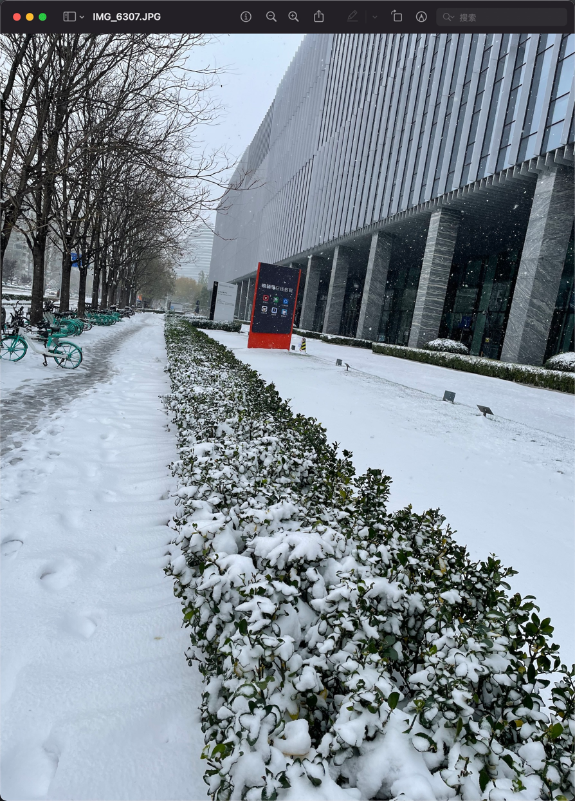
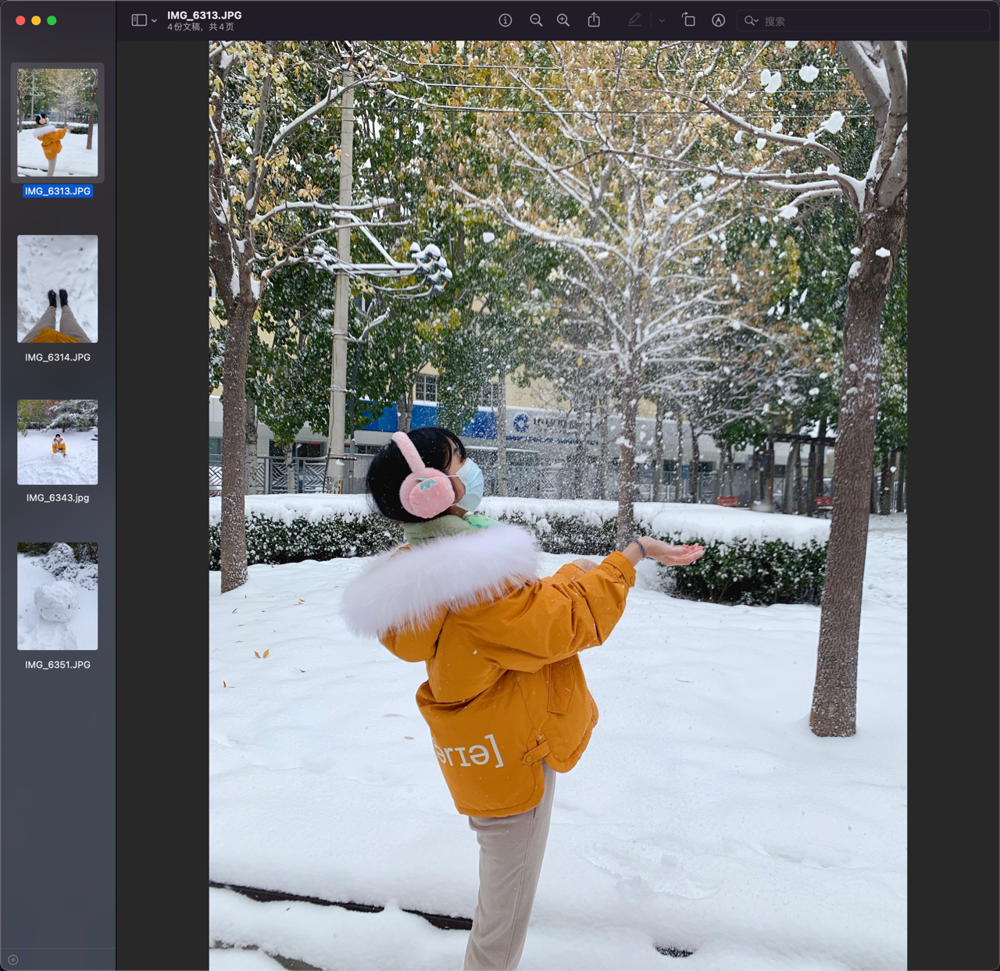
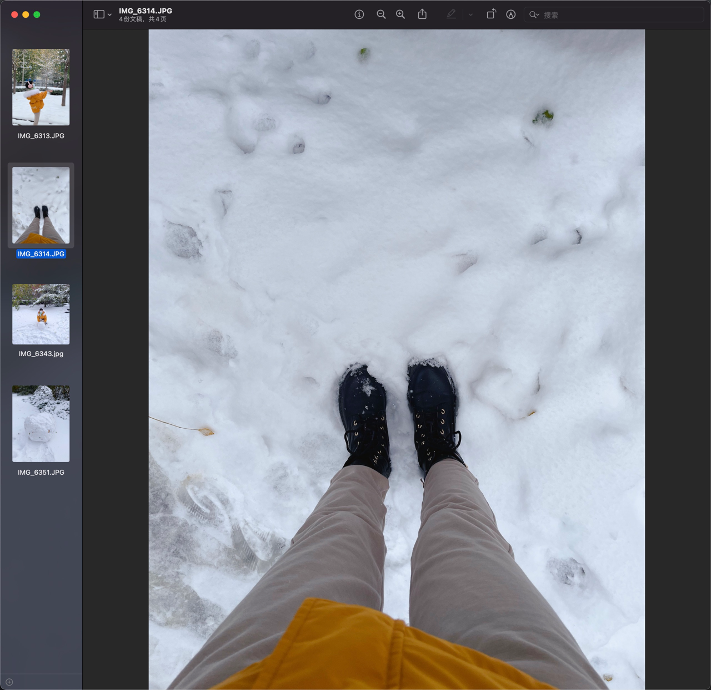
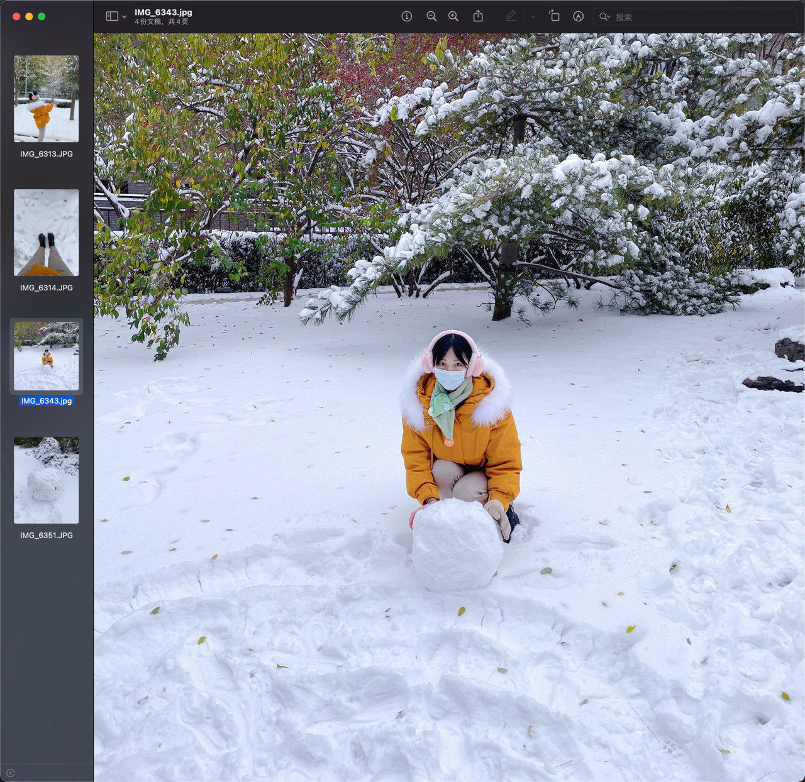
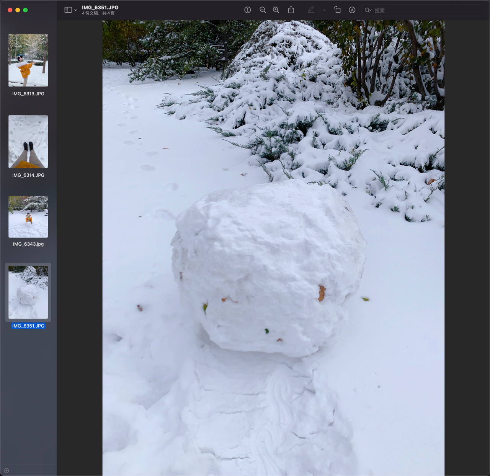

# 2021年初雪

一年有四个季节，每个季节都有不同的景色，而我最喜欢冬天下雪时的壮丽景色。冬天，大雪纷飞人们好象来到了一个幽雅恬静的境界，来到了一个晶莹透剔的童话般的世界。松的那清香，白雪的那冰香，给人一种凉莹莹的抚慰。一切都在过滤，一切都在升华，连我的心灵也在净化，变得纯洁而又美好。

[comment]: <> (![]&#40;./IMG_6307.JPG&#41;)

[comment]: <> (![]&#40;./IMG_6313.JPG&#41;)

[comment]: <> (![]&#40;./IMG_6314.JPG&#41;)

[comment]: <> (![]&#40;./IMG_6351.JPG&#41;)

[comment]: <> (![]&#40;./IMG_6343.jpg&#41;)

白雪纷飞

她在丛中笑

仙女散花

厚厚的白雪

滚雪球

大雪球

