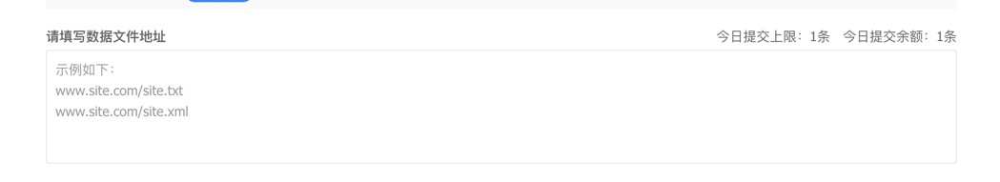
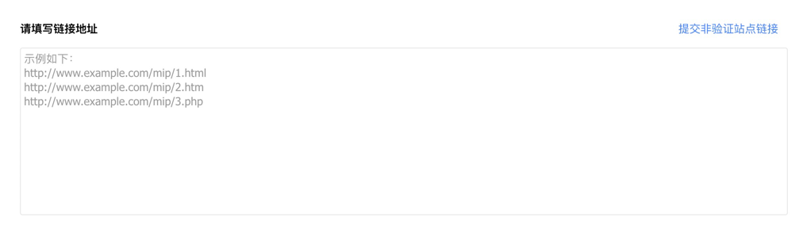

# 百度站长自动推送配置

## 注册百度站长

## 新增站点

## 普通收录

### API 提交

在`github`的`workflow`中配置推送流程，在代码部署的时候自动推送到百度

> 注：API 提交有次数限制

推送流程分三步

1. `workflow`中调用推送流程
2. 根据文件生成所有连接地址
3. 调用百度`API`进行推送

### sitemap

文件地址格式为txt或xml，每个地址文件最多包含50,000个网址且需小于10MB。
sitemap提交工具仅对已验证站点开放使用，开发者无法提交同一主域下其他未验证站点的数据。详细说明
请勿提交索引型sitemap，索引型不予处理，且若存在索引型sitemap，将不允许提交新文件；请删除索引型sitemap后再尝试提交数据。
填写站点的主体备案号，可以提高每日提交上限。去填写

### 手动提交

请在输入框中填写当前选择站点的链接；如需提交其他验证站点链接，请选择对应的站点
您每次最多可提交20条链接，每行一条
仅支持页面对应链接的提交，不支持sitemap形式的文件提交
如果需要提交非验证本站链接，请点击提交非验证站点链接
